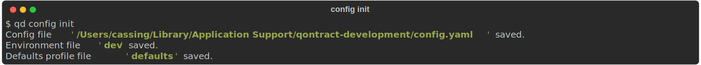
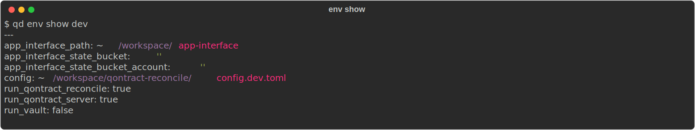
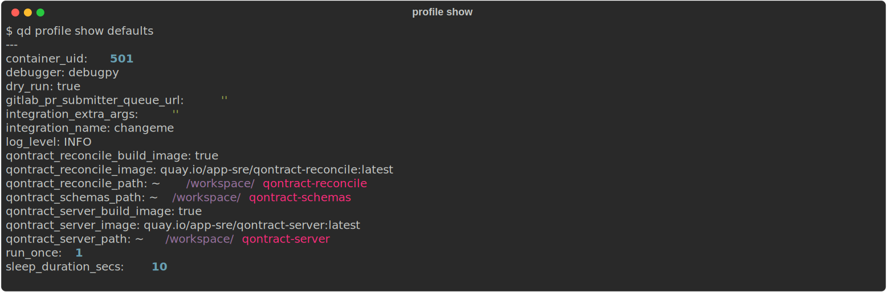
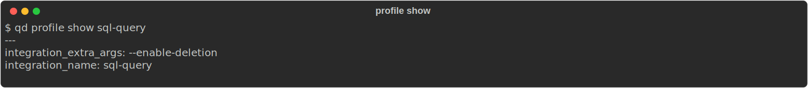

# Qontract Development CLI

[][pypi-link]
[![PyPI platforms][pypi-platforms]][pypi-link]


Qontract Development CLI supports your daily [qontract-reconcile][qontract-reconcile] development work.

## Installation

You can install this library from [PyPI][pypi-link] with `pip`:


```shell
$ python3 -m pip install qontract-development-cli
```

or install it with `pipx`:
```shell
$ pipx install qontract-development-cli
```

You can also use `pipx` to run the library without installing it:

```shell
$ pipx run qontract-development-cli
```

## Quickstart

* Create initial configuration


* Edit configuration


* Edit `dev` environment


* Display `dev` environment


* Edit `defaults` profile


* Display `defaults` profile


* Create a profile `sql-query` to run the `sql-query` integration


* Display `sql-query` profile


* Run `sql-query` profile


## Features

Qontract Development CLI currently provides the following features (get help with `-h` or `--help`):

- Run `qontract-reconcile` and `qontract-server` as docker containers on your local machine
- Support for different environments (dev, prod, ...) via `env` command
- Configure your [qontract-reconcile integration][qontract-reconcile] with the `profile` command
- Bootstrap your initial configurations with the `config` command


[pypi-link]:                https://pypi.org/project/qontract-development-cli/
[pypi-platforms]:           https://img.shields.io/pypi/pyversions/qontract-development-cli
[pypi-version]:             https://badge.fury.io/py/qontract-development-cli.svg
[qontract-reconcile]:       https://github.com/app-sre/qontract-reconcile
