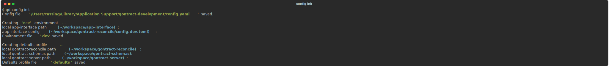
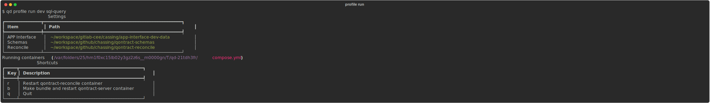

# Qontract Development CLI

[][pypi-link]
[![PyPI platforms][pypi-platforms]][pypi-link]


Qontract Development CLI supports your daily [qontract-reconcile][qontract-reconcile] development work.

## Installation

You can install this library from [PyPI][pypi-link] with `pip`:


```shell
$ python3 -m pip install qontract-development-cli
```

or install it with `pipx`:
```shell
$ pipx install qontract-development-cli
```

You can also use `pipx` to run the library without installing it:

```shell
$ pipx run qontract-development-cli
```

## Quickstart

* Create initial configuration


* Create a profile `sql-query` to run the `sql-query` integration


* Run `sql-query` profile


## Features

Qontract Development CLI currently provides the following features (get help with `-h` or `--help`):

- Run `qontract-reconcile` and `qontract-server` as docker containers on your local machine
- Support for different environments (dev, prod, ...) via `env` command
- Configure your [qontract-reconcile integration][qontract-reconcile] with the `profile` command
- Support pull request reviews (see `profile create`)
- Bootstrap your initial configurations with the `config` command
- Shell autocompletion (see `qd --help`)

## Commands

### Config

Manage global qontract-development CLI configuration.

`qd config --help`

* **edit**: open the configuration file in your favorite editor
* **init**: create a default configuration

#### Settings
| **Key**                     | **Description**                       | **Default**                          |
| --------------------------- | ------------------------------------- | ------------------------------------ |
| debug                       | Enable/disable debug mode             | false                                |
| defaults_profile            | Name of defaults profile              | defaults                             |
| docker_compose_project_name | Docker compose project name           | qontract-development                 |
| editor                      | Your favorite editor                  | $EDITOR or vim                       |
| environments_dir            | Directory to store environment files  | User config directory / environments |
| profiles_dir                | Directory to store profile files      | User config directory / profiles     |
| worktrees_dir               | Directory to store git repo worktrees | User cache directory / worktrees     |

## Environments

An environment specifies app-interface instance settings, e.g., **dev** vs. **prod** config and path to the actual app-interface instance.

`qd env --help`

* **edit**: Create/edit an environment file in your editor.
* **ls**: List all available environments.
* **rm**: Remove environment.
* **show**: Display environment.


#### Settings

| **Key**                            | **Description**                      | **Default**                                    |
| ---------------------------------- | ------------------------------------ | ---------------------------------------------- |
| app_interface_path                 | Path to local app-interface instance | ~/workspace/app-interface                      |
| app_interface_state_bucket         | S3 bucket                            | empty                                          |
| app_interface_state_bucket_account | AWS S3 account                       | empty                                          |
| config                             | app-interface config                 | ~/workspace/qontract-reconcile/config.dev.toml |
| run_qontract_reconcile             | Run qontract-reconcile container     | true                                           |
| run_qontract_server                | Run qontract-server container        | true                                           |
| run_vault                          | Run vault container                  | false                                          |

## Profiles

A profile specifies all settings to run a qontract-reconcile intergration (e.g., *sql-query*).

`qd profile --help`

* **create**: Create a new profile.
* **edit**: Edit a profile in your editor.
* **ls**: List all available profiles.
* **rm**: Remove profile.
* **run**: Run a profile.
* **show**: Display profile.


#### Settings

| **Key**                        | **Description**                                                    | **Default**                               |
| ------------------------------ | ------------------------------------------------------------------ | ----------------------------------------- |
| container_uid                  | Change ownership of /recconcile files in container to this user id | current UID                               |
| debugger                       | Python debugger                                                    | debugpy                                   |
| dry_run                        | Run --dry-run mode                                                 | true                                      |
| gitlab_pr_submitter_queue_url  | Gitlab pr submitter queue url                                      |                                           |
| integration_name               | Intergration name                                                  |                                           |
| integration_extra_args         | Intergration extra arguments                                       |                                           |
| log_level                      | Log level                                                          | info                                      |
| app_interface_path             | App-interface instance path. (Overrides *env.app_interface_path*)  |                                           |
| app_interface_pr               | App-interface PR/MR number                                         |                                           |
| app_interface_upstream         | Upstream remote name                                               | upstream                                  |
| qontract_reconcile_build_image | Build qontract-reconcile image                                     | true                                      |
| qontract_reconcile_image       | Qontract-reconcile image                                           | quay.io/app-sre/qontract-reconcile:latest |
| qontract_reconcile_path        | Qontract-reconcile path                                            | ~/workspace/qontract-reconcile            |
| qontract_reconcile_pr          | Qontract-reconcile PR/MR number                                    |                                           |
| qontract_reconcile_upstream    | Upstream remote name                                               | upstream                                  |
| qontract_server_build_image    | Build qontract-server image                                        | true                                      |
| qontract_server_image          | Qontract-server image                                              | quay.io/app-sre/qontract-server:latest    |
| qontract_server_path           | Qontract-server path                                               | ~/workspace/qontract-server               |
| qontract_schemas_path          | Qontract-schemas path                                              | ~/workspace/qontract-schemas              |
| qontract_schemas_pr            | Qontract-schemas PR/MR number                                      |                                           |
| qontract_schemas_upstream      | Upstream remote name                                               | upstream                                  |
| run_once                       | If 'true', execute the integration once and exit                   | true                                      |
| sleep_duration_secs            | If not *run_once*, sleep duration until integration runs again     | 10                                        |


[pypi-link]:                https://pypi.org/project/qontract-development-cli/
[pypi-platforms]:           https://img.shields.io/pypi/pyversions/qontract-development-cli
[pypi-version]:             https://badge.fury.io/py/qontract-development-cli.svg
[qontract-reconcile]:       https://github.com/app-sre/qontract-reconcile
